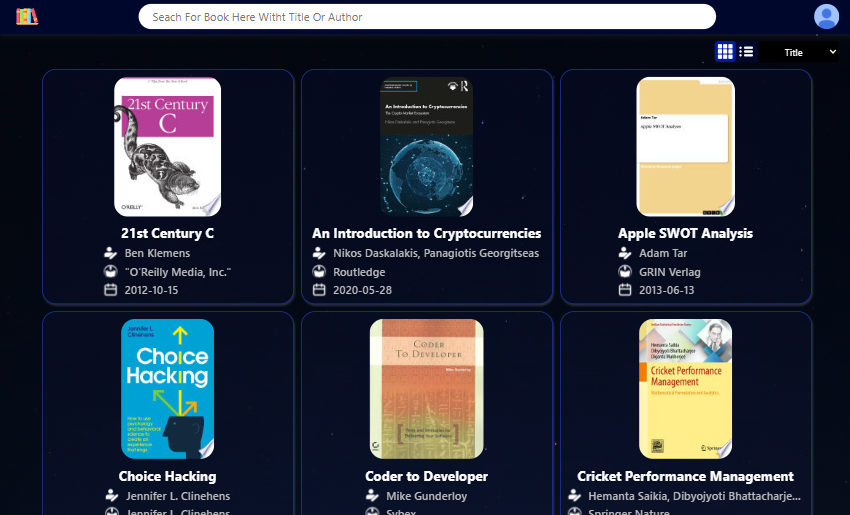
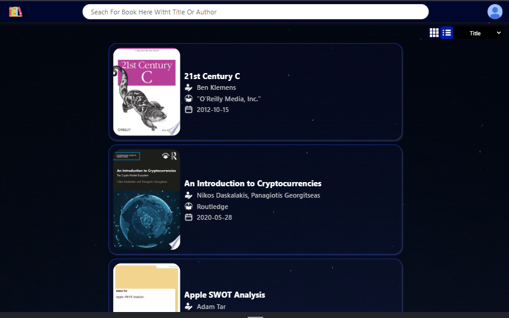
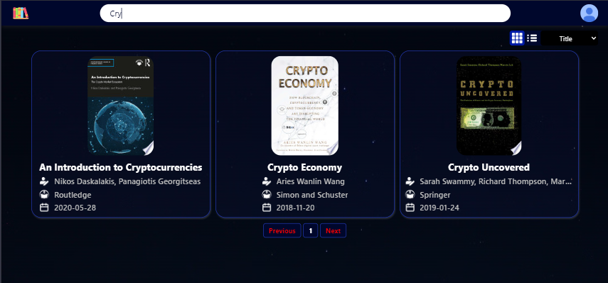
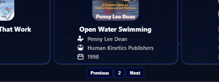

# Book-Library
# [Live Link](https://book-library-ecru-theta.vercel.app/)

Book Library webite using FreeAPI.app that will fetch and display book data dynamically in a user-friendly way.

## Tech Stack
- HTML
- CSS
- JavaScript

## Features

- Fetch books from the API and display them as a list/grid

- Showing Book-Card with details including title, author, publisher, published date, and thumbnail

- search bar to filter books by title or author

- sort feature to list books in Alphabetical order based on their title, date of release (publishedDate)

- pagination on reaching the end of the page to call next, previous set of books

- Clicking on a book item, should open more details in a new tab

